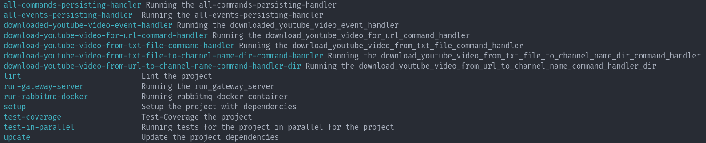

# homelab-manager

Homelab Manager project to manage different things on my homelab server(s) 😊

# Architecture
I'm using the Hexagonal-Architecture (Ports [Interfaces] and Adapters [Implementations]), you can have a glimpse of the architecture from the wiki here [https://en.wikipedia.org/wiki/Hexagonal_architecture_(software)]

# Perquisites

- Python3.11+ and that can be downloaded from here [https://www.python.org/downloads/]
- Make build tool and that can be downloaded from here [https://www.gnu.org/software/make/]
- Poetry package manager for python and that can be downloaded from here [https://python-poetry.org/]
- Docker since we are using TestContainers for testing, you can download it from here [https://www.docker.com/]

# How to know what can be done for the project

```bash
make
```


# How to setup the project's components

```bash
make setup
```

# How to run tests for the project's components

```bash
make test-coverage
```

# Things to be adjusted before running
- There is a `prod.env.example` file inside the `configs` directory, this is an example of the Env Variables that needs to be used for the project, make a copy of the file with the name `prod.env` and put real production values inside it so the project can be using them properly.

# Project's Features

- [x] Video
  - [x] Video Downloader
    - [x] YouTube Video
      - [x] Download a YouTube video to a specific directory
      - [x] Download a YouTube video to a directory of the video's channel name inside a base-directory
      - [x] Download YouTube videos from a urls txt file to a specific directory
      - [x] Download YouTube videos from a urls txt file to a directory of the video's channel name inside a base-directory
  
  - [x] Video Fetcher
    - [x] YouTube Video
      - [x] Fetch YouTube Video Info For Url
      - [x] Fetch Latest YouTube Videos For Channel By Channel Name
  
  - [x] Video's Metadata Persistence
    - [x] YouTube Video
      - [x] Save YouTube Video In Database
      - [x] Get YouTube Video From Database By Video's UUID
      - [x] Get YouTube Video From Database By Video's Title
      - [x] Get YouTube Video From Database By Video's Url
      - [x] Get YouTube Video(s) From Database By Video's Channel-Name
  
  - [ ] Video Tags Generation
  - [ ] Video Transcribe Generation

- [ ] Audio
  - [ ] Audio Downloader
  - [ ] Audio's Metadata Persistence
  - [ ] Audio Tags Generation
  - [ ] Audio Transcribe Generation

- [x] Communication
  - [x] Message Queues
    - [x] RabbitMQ
      - [x] Produce A Message Over A Topic
      - [x] Consume Message(s) Over A Topic

- [x] GateWay
  - [x] RestApi
    - [x] FastApi Implementation Of GateWay


[](https://codecov.io/gh/OWNER/REPO)